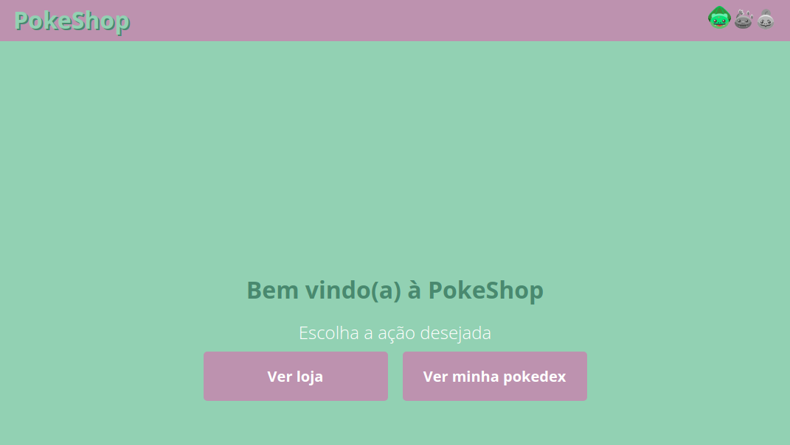
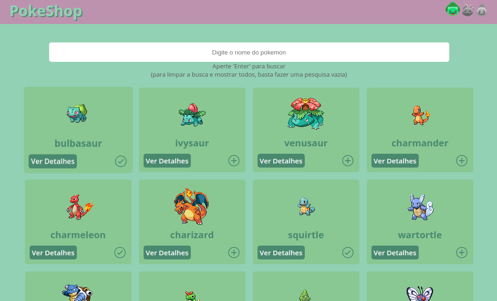
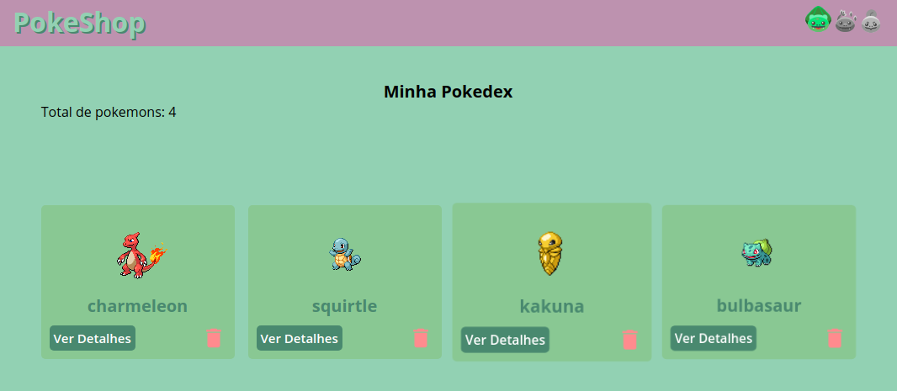
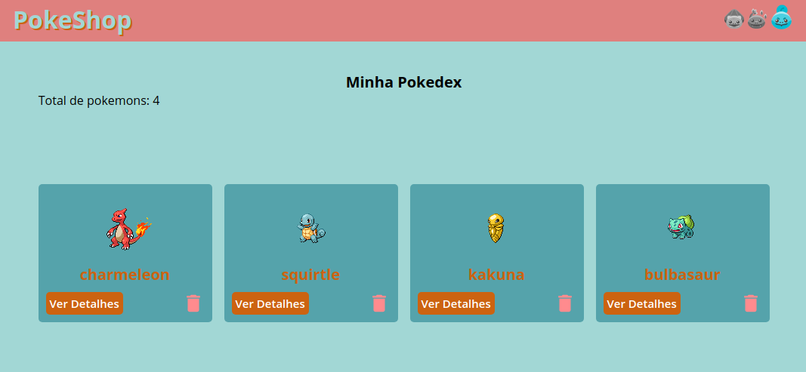
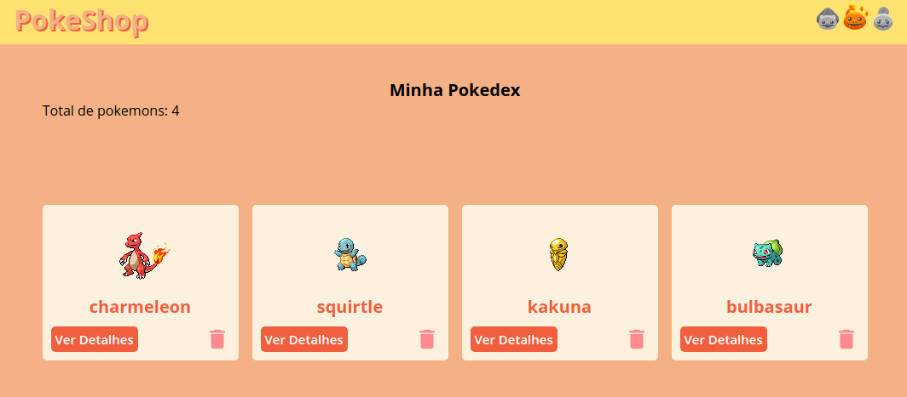
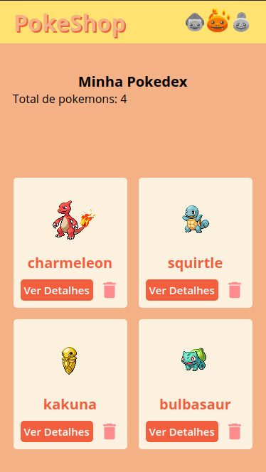
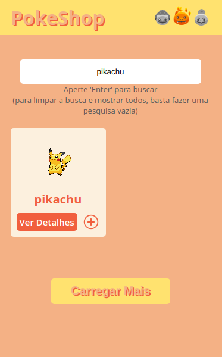

# PokeShop

## Sobre o projeto
Pokedex desenvolvida com ``Next.js`` e `Styled Components`.

## Online no netlify
[Clique aqui para acessar o projeto no netlify](https://wonderful-meitner-b75607.netlify.app/)

## Configurações iniciais

Instale as dependências do projeto rodando o comando:
```
yarn
```
Depois inicie o servidor com o comando:
```
yarn dev
```

#### Bibliotecas utilizadas
- [GraphQl Code Generator](https://graphql-code-generator.com/) ;
- [GraphQL](https://graphql.org/) (para );
- [Redux](https://redux.js.org/);
- [Apollo Client](https://www.apollographql.com/docs/react/) (para );
- [Styled Components](https://styled-components.com/)


# Screenshots

## Tela inicial

## Loja de pokemons

## Pokedex

## Pokedex com o tema do Squirtle

## Pokedex com o tema do charmander

## Pokedex com o tema do charmander modile

## loja de pokemons com o tema do charmander mobile

